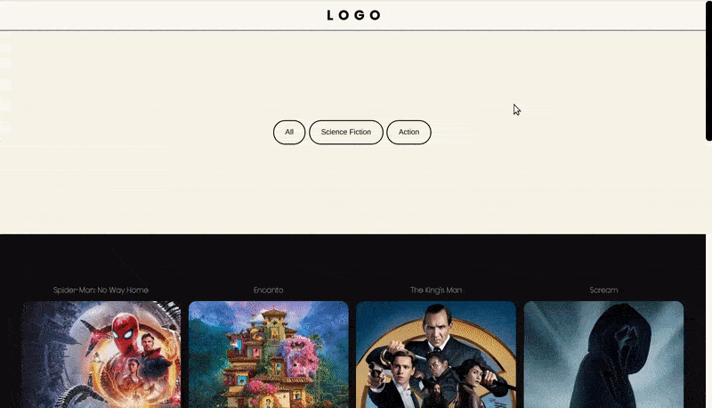

## Filtering Animation with React Tutorial & Framer Motion

<br>
<br>

- Click on the image to see the **2. step** of the project

<br>

[](https://github.com/nadiamariduena/movie-animated-filtering-react/tree/2-button-state-filtering-api-genres)

<br>
<br>

---

<br>
<br>

# 🍍

## Animating the cards

- import **framer-motion** in the **Home.jsx**

```javascript
import { motion } from "framer-motion";
```

<br>

#### ⚠️ if there s an error, just replace the new version with an older one:

```javascript
"framer-motion": "^4.1.17",
```

<br>

##### attach the motion to the div that wraps the cards 'in the mapping section

```javascript
//       BEFORE
    <PopularMovies>

            {filtered.map((movie) => (
              <div key={movie.id}>
                <MovieCard movie={movie} />
              </div>
            ))}

        </PopularMovies>
//

//       AFTER
//
    <PopularMovies>
          <motion.div className="wrapper-cards">
            {filtered.map((movie) => (
              <div key={movie.id}>
                <MovieCard movie={movie} />
              </div>
            ))}
          </motion.div>
        </PopularMovies>
```

<br>

##### Modify the styles

```javascript
//before

const PopularMovies = styled.div`

display: grid;
grid-template-columns: repeat(auto-fit, minmax(250px, 1fr));
grid-column-gap: 1rem;
grid-row-gap: 2rem;
margin-top: 40px;
padding: 40px 40px;


`;

//
//
//after
const PopularMovies = styled.div`

//
  .wrapper-cards {
    display: grid;
    grid-template-columns: repeat(auto-fit, minmax(250px, 1fr));
    grid-column-gap: 1rem;
    grid-row-gap: 2rem;
    margin-top: 40px;
    padding: 40px 40px;
  }

```

<br>

#### The reason for this, is because it seems like framer-Motion doesnt work with styled components.

- If you try it you can see that the grid will behave differently

<br>
<br>

### 🌈

#### the animation settings

- add the **layout**, first to the parent and then to the child, which is the **MovieCard.jsx**

<br>

```javascript
<motion.div layout className="wrapper-cards">
  {filtered.map((movie) => (
    <div key={movie.id}>
      <MovieCard movie={movie} />
    </div>
  ))}
</motion.div>
```

<br>

#### ⚠️

- as you will notice that if you only add it to the parent, **it will cause an ugly image stretching**.

<br>

[]()

<br>

<br>

#### Add it to the child

- **MovieCard.jsx**

```javascript
import React from "react";
import { motion } from "framer-motion";

const MovieCard = ({ movie }) => {
  return (
    <motion.div layout>
      <h2>{movie.title}</h2>
      
    </motion.div>
  );
};

export default MovieCard;
```

<br>

##### result

- Its okay but you can still add more settings

[]()

<br>

##### Lets make it smooth

- add a fade in and fade out, so that it don't disappear abruptly

- Go to the **MovieCard.jsx**

```javascript
<motion.div
  animate={{ opacity: 1 }}
  initial={{ opacity: 0 }}
  exit={{ opacity: 0 }}
  layout
>
  <h2>{movie.title}</h2>
  
</motion.div>
```

<br>

- Here you can notice the **fade in** in the beginning

<br>

[]()

<br>

#### As you can see, the fade in works, but the fade out "doesnt", so what we will have to do is add something called "AnimatedPresence"

```javascript
import { motion, AnimatePresence } from "framer-motion";
```

```javascript
import React, { useEffect, useState } from "react";
import styled from "styled-components";
// import { mobile, mobileM, tablet } from "../responsive";
import { Filter } from "./Filter";
import MovieCard from "./MovieCard";
import { motion, AnimatePresence } from "framer-motion";

// API
const { REACT_APP_TMDB_KEY } = process.env;
//

const Wrapper = styled.div`
  width: 100vw;
  min-height: 100vh;
  padding: 0 0 60px 0;
  text-align: center;
  background: #0f0f0f;
  h1 {
    padding: 10px 0;
    font-size: calc(25px + 1.8vmin);
    text-transform: uppercase;
    font-weight: 600;
  }
`;

//
//
const AddContent = styled.div`
  padding: 0px 0 20px 0;
`;

//
// -- GRID --
const PopularMovies = styled.div`
  .wrapper-cards {
    display: grid;
    grid-template-columns: repeat(auto-fit, minmax(250px, 1fr));
    grid-column-gap: 1rem;
    grid-row-gap: 2rem;
    margin-top: 40px;
    padding: 40px 40px;
  }
  /*  */
  img {
    width: 100%;
    height: 30vh;
    object-fit: cover;
    margin-bottom: 1rem;
    border-radius: 1rem;
  }

  h2 {
    padding: 10px 0;
    font-size: calc(6px + 1vmin);
    font-weight: 600;
    color: #f7f4e79a;
    font-family: "PoppinsThin";
  }
`;
//
//
const Home = () => {
  //
  //4
  const [popular, setPopular] = useState([]);
  //
  const [filtered, setFiltered] = useState([]);
  //
  const [activeGenre, setActiveGenre] = useState(0);
  //
  //2
  useEffect(() => {
    fetchPopular();
  }, []);

  //
  //1
  const fetchPopular = async () => {
    //
    const data = await fetch(
      `https://api.themoviedb.org/3/movie/popular?api_key=${REACT_APP_TMDB_KEY}&language=en-US&page=1&include_adult=false`
    );
    //
    const movies = await data.json();
    console.log(movies);
    setPopular(movies.results);
    //
    setFiltered(movies.results);
  };

  //
  //

  return (
    <Wrapper>
      {" "}
      <Filter
        popular={popular}
        setFiltered={setFiltered}
        activeGenre={activeGenre}
        setActiveGenre={setActiveGenre}
      />
      <AddContent>
        <PopularMovies>
          <motion.div layout className="wrapper-cards">
            ✋{" "}
            <AnimatePresence>
              {" "}
              {filtered.map((movie) => (
                <div key={movie.id}>
                  <MovieCard movie={movie} />
                </div>
              ))}
            </AnimatePresence>
          </motion.div>
        </PopularMovies>
      </AddContent>
    </Wrapper>
  );
};

export default Home;
```

<br>
<br>

```javascript
import React from "react";
import { motion } from "framer-motion";

const MovieCard = ({ movie }) => {
  return (
    <motion.div
      layout
      animate={{ opacity: 1 }}
      initial={{ opacity: 0 }}
      exit={{ opacity: 0 }}
      transition={{ duration: 0.5 }}
    >
      <h2>{movie.title}</h2>
      
    </motion.div>
  );
};

export default MovieCard;
```

<br>

#### As you can see, I added a transition, its not so coold for performance but its okay for this project.

[]()
