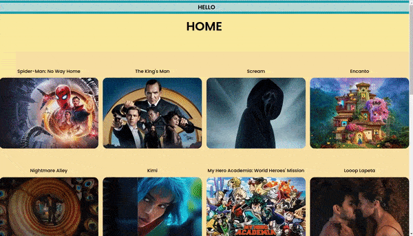
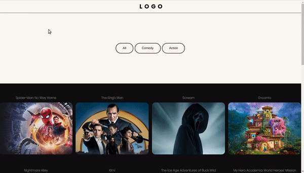
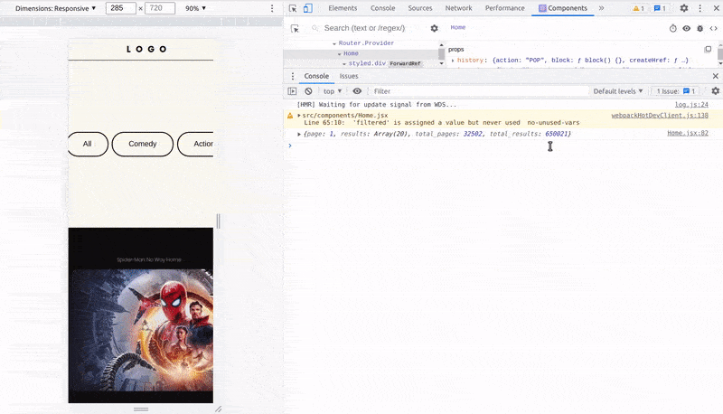
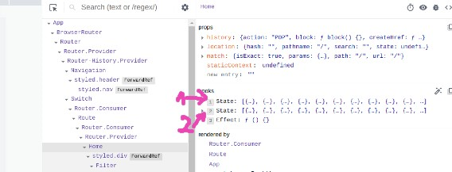
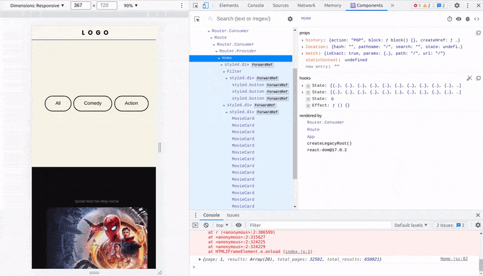
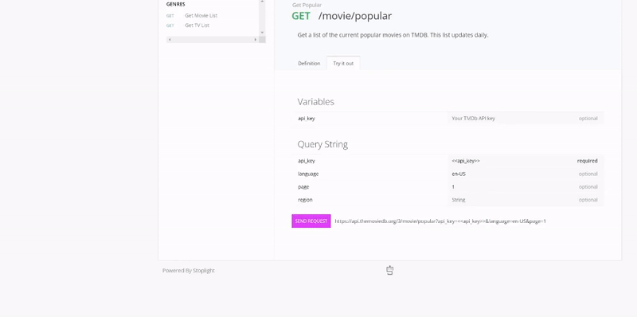
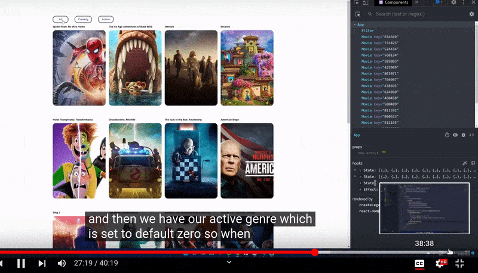
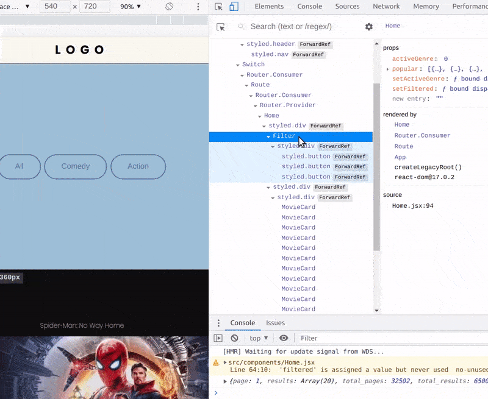

## Filtering Animation with React Tutorial & Framer Motion

<br>
<br>

- Click on the image to see the **1. step** of the project

<br>

[](https://github.com/nadiamariduena/movie-animated-filtering-react/tree/1app-stup-api-setup-fetching-styles)

<br>
<br>

---

<br>
<br>

## Buttons 🥭

- Create a new component inside the **components** folder, and call it **Filter.jsx**

<br>

- Import the **useEffect & useState**

<br>

```javascript
import React, { useEffect, useState } from "react";
```

<br>

#### Add some basic styles

```javascript
import React from "react";
import styled from "styled-components";

//
//
const FilterContainer = styled.div`
  margin-top: 40px;
  padding: 20px 0;
  height: 30vh;
  display: flex;
  justify-content: center;
  align-items: center;
`;
const Button = styled.button`
  margin: 0 3px;
  padding: 12px 28px;
  border-radius: 2rem;
  border: 2px solid #000;
  background: transparent;
  color: #000;
  cursor: pointer;
  /*  */
  &:hover {
    background: #f7f4e79a;

    color: #0e0e0e;
  }
  &:active {
    background: #000;
    color: #ffffff;
  }
`;
//

export const Filter = () => {
  return (
    <FilterContainer>
      <Button>All</Button>
      <Button>Comedy</Button>
      <Button>Action</Button>
    </FilterContainer>
  );
};
```

<br>
<br>

### Import it to the Home.jsx

```javascript
import { Filter } from "./Filter";


//
//
  return (
    <Wrapper>
      <Filter /> ✋
```

[]()

<br>
<br>

## Key error 🔴

<br>

```javascript
index.js:1 Warning: Each child in a list should have a unique "key" prop.

Check the render method of `Home`. See https://reactjs.org/link/warning-keys for more information.
```

<br>

> Even if I know that the solution is adding this: **key={movie.id}** sometimes it just dont work, and the reason for that is as you can see in the 2 examples below:

<br>
<br>

### solution 🌈

- Remove the fragments **<></>**

```javascript

//
//      BEFORE
<PopularMovies>
   {popular.map((movie) => (
            <>
              <MovieCard key={movie.id} movie={movie} />
            </>
          ))}
</PopularMovies>
//
//
//
//
//      AFTER
<PopularMovies>
  {popular.map((movie) => (
    <div key={movie.id}>
      <MovieCard movie={movie} />
    </div>
  ))}
</PopularMovies>
```

<br>
<br>

# 🐖

## Create a new state

- 1. This **new** state will serve to **copy everything** from the following variable

```javascript
 const [popular
```

<br>

- 2. But will filters out **the elements or the movies** based in what we are clicking on

<br>

##### the new state

```javascript
const [filtered, setFiltered] = useState([]);
```

<br>

#### Recapitulation:

> So this new **variable/state** called **filtered** is going to copy all from the state variable **popular** but will filter out **the elements or the movies** based in what we are clicking on

<br>

### 👾👾👾

##### The reason why we are duplicating the <u>popular</u> state, is because if we mess out with the "popular" when updating, there is no way to go back to the original state, unless we do another FETCH request, which we dont want to do, as we dont want to do MULTIPLE fetch requests if you already have the same DATA stored.

### 👾👾👾

<br>

#### use the new state here:

```javascript
const movies = await data.json();
console.log(movies);
setPopular(movies.results);
//
setFiltered(movies.results); ✋
```

<br>

## 👁️

##### Now let's check if we can see the second state on the console

- As you can see in the gif, we have 2 states containing the same data ✋

[]()

<br>
<br>

- the 1 is the original state

- the 2 one is the **filter** state

[]()

<br>
<br>

#### Before continuing lets add another state, this state will take care of the genre, so to know which button is active

```javascript
const [activeGenre, setActiveGenre] = useState(0);
```

<br>

#### 🐖

- to know why we get into the **0**, you have to go to the component in the console.

<br>

[]()

<br>

#### By default the state is going to be 0, but why 0?

<br>

- As you can see in the gif, when we open the object containing one single movie, we will notice that **the genre contains numbers**, but why the numbers don't start from 0?

<br>

> its because this **API** was made like that, they added their genres in such way

<br>

#### To understand it better, you have to go to the api [genres/get-movie-list](https://developers.themoviedb.org/3/genres/get-movie-list) , add your api key like in the gif below

<br>

[]()

- then copy the url and paste it inside the browser, then you will get this:

<br>

#### Genre List

```javascript
{
  "genres": [
    {
      "id": 28,
      "name": "Action"
    },
    {
      "id": 12,
      "name": "Adventure"
    },
    {
      "id": 16,
      "name": "Animation"
    },
    {
      "id": 35,
      "name": "Comedy"
    },
    {
      "id": 80,
      "name": "Crime"
    },
    {
      "id": 99,
      "name": "Documentary"
    },
    {
      "id": 18,
      "name": "Drama"
    },
    {
      "id": 10751,
      "name": "Family"
    },
    {
      "id": 14,
      "name": "Fantasy"
    },
    {
      "id": 36,
      "name": "History"
    },
    {
      "id": 27,
      "name": "Horror"
    },
    {
      "id": 10402,
      "name": "Music"
    },
    {
      "id": 9648,
      "name": "Mystery"
    },
    {
      "id": 10749,
      "name": "Romance"
    },
    {
      "id": 878,
      "name": "Science Fiction"
    },
    {
      "id": 10770,
      "name": "TV Movie"
    },
    {
      "id": 53,
      "name": "Thriller"
    },
    {
      "id": 10752,
      "name": "War"
    },
    {
      "id": 37,
      "name": "Western"
    }
  ]
}

```

<br>

##### SO the 0 we added, we are going to configure it ourselves later one

<br>

---

<br>

### Add the states to the Filter component

<br>

- **Home.jsx**

```javascript
return (
    <Wrapper>

      <Filter
         popular={popular}
        setFiltered={setFiltered}
        activeGenre={activeGenre}
        setActiveGenre={setActiveGenre}
      />
```

<br>
<br>

### Now lets access the props above inside the Filter.jsx

```javascript
export const Filter = ({
  setFiltered,
  activeGenre,
  setActiveGenre,
  popular,
}) => {
  return (
    <FilterContainer>
      <Button>All</Button>
      <Button>Comedy</Button>
      <Button>Action</Button>
    </FilterContainer>
  );
};
```

##### Lets use it

- remember that those numbers have something to do with the list of numbers i added above in the **Genre List**

```javascript
export const Filter = ({
  setFiltered,
  activeGenre,
  setActiveGenre,
  popular,
}) => {
  return (
    <FilterContainer>
      <Button onClick={() => setActiveGenre(0)}> All</Button>
      <Button onClick={() => setActiveGenre(35)}>Comedy</Button>
      <Button onClick={() => setActiveGenre(28)}>Action</Button>
    </FilterContainer>
  );
};
```

<br>

[]()

<br>
<br>

### In my app

[]()
