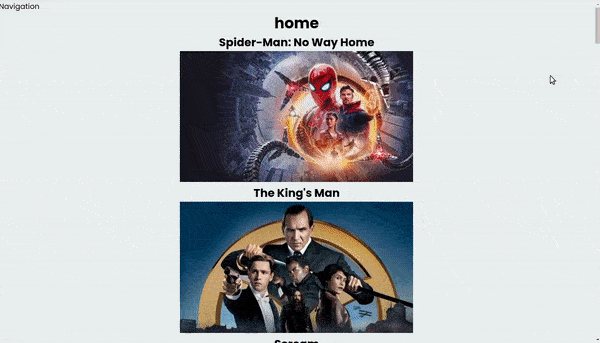

## Filtering Animation with React Tutorial & Framer Motion

<br>
<br>

# 🌈

## Lets Begin!

- Install the following:

```javascript
    "framer-motion": "^6.2.8",
    "node-sass": "^4.14.1",
    "react": "^17.0.2",
    "react-dom": "^17.0.2",
    "react-icons": "^4.3.1",
    "react-player": "^2.9.0",
    "react-router-dom": "^5.3.0",
    "react-scripts": "4.0.3",
    "styled-components": "^5.3.3",
```

<br>
<br>

---

<br>
<br>

# The Api 🥭

#### I will be using the same API (from the previous tutorial)

<br>

#### 🔴 Remember:

> **You need to request the API key**, you will have to fill a form about why do and in what do you want to use, after that you will receive your api in your email, or just refresh the page

<br>

- Go to the api website [TMDB](https://developers.themoviedb.org/3/getting-started/introduction) and look in the side bar, for[ SEARCH ](https://developers.themoviedb.org/3/search/search-companies)

- Then click again in side bar, for **search the movie**

<br>

<br>

### Search

- This is the endpoint for that:

#### ENDPOINT 1.: get/search/movie ✋

```javascript
https://api.themoviedb.org/3/search/movie?api_key=<<api_key>>&language=en-US&page=1&include_adult=false
```

<br>

[](https://developers.themoviedb.org/3/search/search-movies)

<br>

## Popular

##### You can also choose something else, like for example ["Get Popular"](https://developers.themoviedb.org/3/movies/get-popular-movies)

<br>

- This is the endpoint for that:

#### ENDPOINT 2.: GET /movie/popular

```javascript
 https://api.themoviedb.org/3/movie/popular?api_key=<<api_key>>&language=en-US&page=1
```

<br>

[](https://developers.themoviedb.org/3/search/search-movies)

<br>

<br>

---

<br>

## Once you have the API:

- Create a **.env.local** and **store your API** there like so:

```javascript
REACT_APP_TMDB_KEY=long api code here
```

<br>

##### ⚠️ After you add the API inside the .env.local , restart the app.

<br>
<br>

### Adding the <u>API</u> to the app

<br>

- Every time you are requesting something from an external API, you will need <u>**async await**</u>, and the reason for that is because you can have different type of issues, issues that can cause the data not being delivered in time when the user opens the page for example.

<br>

- One of the reasons can be **"slow internet connection", latency ...etc**

<br>

```javascript
const Home = () => {
  // without async | WRONG 🔴
  const fetchPopular = () => {
    //   api goes here / fetching data from the api
  };

//
  // with async | GOOD  ✋
  const fetchPopular = async () => {
    //   api goes here / fetching data from the api
  };
```

<br>

#### [Latency ](<https://en.wikipedia.org/wiki/Latency_(engineering)>)

> **Latency meaning in networking** is best thought of as the amount of time it takes for a packet of data to be captured, transmitted, processed through multiple devices, then received at its destination and decoded. ... Latency is measured in milliseconds, or during speed tests, it's referred to as a ping rate.

<br>
<br>

### Add it like so:

- Now that **data** contains the **movies url**, we will need to convert this data to a JSON format

```javascript
// API
const { REACT_APP_TMDB_KEY } = process.env;

//
const Home = () => {
  //
  //
  const fetchPopular = async () => {
    //
    const data = await fetch(
      `https://api.themoviedb.org/3/movie/popular?api_key=${REACT_APP_TMDB_KEY}&language=en-US&page=1&include_adult=false`
    );
    //

  };
```

<br>
 
#### Convert this data to a JSON format

<br>

```javascript
//
const fetchPopular = async () => {
  //
  const data = await fetch(
    `https://api.themoviedb.org/3/movie/popular?api_key=${REACT_APP_TMDB_KEY}&language=en-US&page=1&include_adult=false`
  );
  //
  const movies = await data.json(); ✋ // converting the data
};
```

<br>

#### Now we need to store this data somewhere and make that the function above with the fetched DATA "runs", as for now its not doing anything.

<br>

#### We will start by importing <u>useEffect and useState</u>

```javascript
import React, { useEffect, useState } from "react";
```

<br>

- the **useEffect** here is used when the component renders,

<br>

# ⚠️

#### Things he didnt explain in the tutorial:

- why isnt a good idea adding async directly in the useEffect? Of course he didnt do it but he directly add the function inside the useEffect without explaining why, as you can see it in the video.

##### 7:31 [Awesome Filtering Animation with React Tutorial](https://youtu.be/nyg5Lpl6AiM)

<br>

#### why create a function with async await inside a useEffect.

- Read it in the link below about wjat not to do:

##### [React Hooks: async function in the useEffect ](https://dev.to/danialdezfouli/what-s-wrong-with-the-async-function-in-useeffect-4jne)

<br>

<br>

## UseEffect

- Call the **fetchPopular** function

<br>
<br>

```javascript
const Home = () => {
  //
  //3 call the function from step 1
  useEffect(() => {
    fetchPopular();
  }, []);

  //
  //1
  const fetchPopular = async () => {
    //
    const data = await fetch(
      `https://api.themoviedb.org/3/movie/popular?api_key=${REACT_APP_TMDB_KEY}&language=en-US&page=1&include_adult=false`
    );
    //2
    const movies = await data.json();
  };
  return (
```

<br>
<br>

#### Now store that data somewhere

- We will be storing the data in the state below:

> **popular** is like a **variable** and **setPopular** is the thing connected to that variable that is going to modify this variable, a bit like the "you" of the present and the "you" of the future after you changed, that is the setPopular.

<br>

```javascript
//4
const [popular, setPopular] = useState([]);
```

<br>

#### And we will be adding for default this: useState([]);

- The reason for that is because the data we are going to get from the **fetchPopular function**,is an array of objects.

<br>

```javascript
const movies = await data.json();
console.log(movies);
```

##### result

```javascript
Object
page: 1
results: Array(20)
0: {adult: false, backdrop_path: '/iQFcwSGbZXMkeyKrxbPnwnRo5fl.jpg', genre_ids: Array(3), id: 634649, original_language: 'en', …}
1: {adult: false, backdrop_path: '/4OTYefcAlaShn6TGVK33UxLW9R7.jpg', genre_ids: Array(4), id: 476669, original_language: 'en', …}
2: {adult: false, backdrop_path: '/usaZV7KB6Man9Rm9TyDAeQf7uVD.jpg', genre_ids: Array(3), id: 646385, original_language: 'en', …}
3: {adult: false, backdrop_path: '/3G1Q5xF40HkUBJXxt2DQgQzKTp5.jpg', genre_ids: Array(4), id: 568124, original_language: 'en', …}
4: {adult: false, backdrop_path: '/mqDnDhG5N6fn1H4MKQqr8E5wfeK.jpg', genre_ids: Array(3), id: 597208, original_language: 'en', …}
5: {adult: false, backdrop_path: '/mruT954ve6P1zquaRs6XG0hA5k9.jpg', genre_ids: Array(1), id: 800510, original_language: 'en', …}
6: {adult: false, backdrop_path: '/cugmVwK0N4aAcLibelKN5jWDXSx.jpg', genre_ids: Array(4), id: 768744, original_language: 'ja', …}
7: {adult: false, backdrop_path: '/qlPbDersJDdeBORrENQjoz9JfwJ.jpg', genre_ids: Array(5), id: 783461, original_language: 'hi', …}
8: {adult: false, backdrop_path: '/eG0oOQVsniPAuecPzDD1B1gnYWy.jpg', genre_ids: Array(4), id: 774825, original_language: 'en', …}
9: {adult: false, backdrop_path: '/c6H7Z4u73ir3cIoCteuhJh7UCAR.jpg', genre_ids: Array(4), id: 524434, original_language: 'en', …}
10: {adult: false, backdrop_path: '/eVSa4TpyXbOdk9fXSD6OcORJGtv.jpg', genre_ids: Array(1), id: 803114, original_language: 'en', …}
11: {adult: false, backdrop_path: '/dK12GIdhGP6NPGFssK2Fh265jyr.jpg', genre_ids: Array(4), id: 512195, original_language: 'en', …}
12: {adult: false, backdrop_path: '/qBLEWvJNVsehJkEJqIigPsWyBse.jpg', genre_ids: Array(5), id: 585083, original_language: 'en', …}
13: {adult: false, backdrop_path: '/tutaKitJJIaqZPyMz7rxrhb4Yxm.jpg', genre_ids: Array(4), id: 438695, original_language: 'en', …}
14: {adult: false, backdrop_path: '/koaxq5QbARIlfxCOR89atPHv367.jpg', genre_ids: Array(3), id: 615904, original_language: 'en', …}
15: {adult: false, backdrop_path: '/t4To8feUSysyBs4tlBAbXIrKlCv.jpg', genre_ids: Array(2), id: 860623, original_language: 'en', …}
16: {adult: false, backdrop_path: '/cTTggc927lEPCMsWUsdugSj6wAY.jpg', genre_ids: Array(2), id: 335787, original_language: 'en', …}
17: {adult: false, backdrop_path: '/EnDlndEvw6Ptpp8HIwmRcSSNKQ.jpg', genre_ids: Array(3), id: 425909, original_language: 'en', …}
18: {adult: false, backdrop_path: '/vIgyYkXkg6NC2whRbYjBD7eb3Er.jpg', genre_ids: Array(3), id: 580489, original_language: 'en', …}
19: {adult: false, backdrop_path: '/o76ZDm8PS9791XiuieNB93UZcRV.jpg', genre_ids: Array(3), id: 460458, original_language: 'en', …}
length: 20
[[Prototype]]: Array(0)
total_pages: 32495
total_results: 649888
[[Prototype]]: Object
```

<br>
<br>

#### With <u>setPopular(movies.results)</u> You will be able to see the 'results'

```javascript
const movies = await data.json();
console.log(movies); //just to see the object in the console
setPopular(movies.results);
```

#### Result

```javascript
{page: 1, results: Array(20), total_pages: 32495, total_results: 649888}page: 1results: Array(20)0: {adult: false, backdrop_path: '/iQFcwSGbZXMkeyKrxbPnwnRo5fl.jpg', genre_ids: Array(3), id: 634649, original_language: 'en', …}1: {adult: false, backdrop_path: '/4OTYefcAlaShn6TGVK33UxLW9R7.jpg', genre_ids: Array(4), id: 476669, original_language: 'en', …}2: {adult: false, backdrop_path: '/usaZV7KB6Man9Rm9TyDAeQf7uVD.jpg', genre_ids: Array(3), id: 646385, original_language: 'en', …}3: {adult: false, backdrop_path: '/3G1Q5xF40HkUBJXxt2DQgQzKTp5.jpg', genre_ids: Array(4), id: 568124, original_language: 'en', …}4: {adult: false, backdrop_path: '/mqDnDhG5N6fn1H4MKQqr8E5wfeK.jpg', genre_ids: Array(3), id: 597208, original_language: 'en', …}5: {adult: false, backdrop_path: '/mruT954ve6P1zquaRs6XG0hA5k9.jpg', genre_ids: Array(1), id: 800510, original_language: 'en', …}6: {adult: false, backdrop_path: '/cugmVwK0N4aAcLibelKN5jWDXSx.jpg', genre_ids: Array(4), id: 768744, original_language: 'ja', …}7: {adult: false, backdrop_path: '/qlPbDersJDdeBORrENQjoz9JfwJ.jpg', genre_ids: Array(5), id: 783461, original_language: 'hi', …}8: {adult: false, backdrop_path: '/eG0oOQVsniPAuecPzDD1B1gnYWy.jpg', genre_ids: Array(4), id: 774825, original_language: 'en', …}9: {adult: false, backdrop_path: '/c6H7Z4u73ir3cIoCteuhJh7UCAR.jpg', genre_ids: Array(4), id: 524434, original_language: 'en', …}10: {adult: false, backdrop_path: '/eVSa4TpyXbOdk9fXSD6OcORJGtv.jpg', genre_ids: Array(1), id: 803114, original_language: 'en', …}11: {adult: false, backdrop_path: '/dK12GIdhGP6NPGFssK2Fh265jyr.jpg', genre_ids: Array(4), id: 512195, original_language: 'en', …}12: {adult: false, backdrop_path: '/qBLEWvJNVsehJkEJqIigPsWyBse.jpg', genre_ids: Array(5), id: 585083, original_language: 'en', …}13: {adult: false, backdrop_path: '/tutaKitJJIaqZPyMz7rxrhb4Yxm.jpg', genre_ids: Array(4), id: 438695, original_language: 'en', …}14: {adult: false, backdrop_path: '/koaxq5QbARIlfxCOR89atPHv367.jpg', genre_ids: Array(3), id: 615904, original_language: 'en', …}15: {adult: false, backdrop_path: '/t4To8feUSysyBs4tlBAbXIrKlCv.jpg', genre_ids: Array(2), id: 860623, original_language: 'en', …}16: {adult: false, backdrop_path: '/cTTggc927lEPCMsWUsdugSj6wAY.jpg', genre_ids: Array(2), id: 335787, original_language: 'en', …}17: {adult: false, backdrop_path: '/EnDlndEvw6Ptpp8HIwmRcSSNKQ.jpg', genre_ids: Array(3), id: 425909, original_language: 'en', …}18: {adult: false, backdrop_path: '/vIgyYkXkg6NC2whRbYjBD7eb3Er.jpg', genre_ids: Array(3), id: 580489, original_language: 'en', …}19: {adult: false, backdrop_path: '/o76ZDm8PS9791XiuieNB93UZcRV.jpg', genre_ids: Array(3), id: 460458, original_language: 'en', …}length: 20[[Prototype]]: Array(0)total_pages: 32495total_results: 649888[[Prototype]]: Object
```

<br>
<br>

---

<br>
<br>

## 🍨

## mapping the data 'movies'

- We will be mapping the movies in the same component, but we will create another component for the movie **card**

<br>

```javascript

  return (
    <Wrapper>
      <Container>
        <AddContent>
          <h1>home</h1>
          {popular.map((movie) => (
            <h1>movies</h1>
          ))}
        </AddContent>{" "}
      </Container>
    </Wrapper>
  );
};
```

<br>
<br>

#### Create a Movie card component

- INside the **components** folder, Add the following:

```javascript
import React from "react";

const Movie = () => {
  return (
    <div>
      <h2>Title</h2>
      
    </div>
  );
};

export default Movie;
```

<br>
<br>

#### Now go back to the Home.jsx

- import the card component

> import Movie from "./Movie";

#### and use it here:

```javascript
return (
  <Wrapper>
    <Container>
      <AddContent>
        <h1>home</h1>
        {popular.map((movie) => (
          <>
            <Movie /> ✋
          </>
        ))}
      </AddContent>{" "}
    </Container>
  </Wrapper>
);
```

<br>
<br>

#### Now pass the prop, so that we can use it inside the card of the movie.

- **this is the prop:** movie={movie}

<br>

- this **key={movie.id}** is important because react ask that everything that is mapped should contain a unique key, otherwise you will have an error in the console

<br>

```javascript
return (
  <Wrapper>
    <Container>
      <AddContent>
        <h1>home</h1>
        {popular.map((movie) => (
          <>
            <Movie key={movie.id} movie={movie} /> ✋
          </>
        ))}
      </AddContent>{" "}
    </Container>
  </Wrapper>
);
```

<br>
<br>

#### Now lets access the data from the code above inside the CARD component through the key

- movie={movie}

```javascript
import React from "react";

const Movie = ({ movie  ✋}) => {
  return (
    <div>
      <h2>{movie.title}</h2> ✋

    </div>
  );
};

export default Movie;
```

<br>

# ⚠️

#### Here for example, we cannot do this

- In normal times when you want to show an image coming from json, you just have to do this: <u>**movie.img**</u>, and that will be all:

```javascript

```

<br>

## Good 🐖

> But since we are using an **API** , we have to **prepend** the url of the image, like so:

```javascript
src={"https://image.tmdb.org/t/p/w200" + movie.backdrop_path}
                alt={`${movie.title} Poster`}
```

<br>

#### Also Good 🐖

##### comparing to the other [ project](https://github.com/nadiamariduena/movie-watchlist-reacthooks-context-api) i made before this:

- this is a snipped of the other code ([compare the code here ](https://github.com/nadiamariduena/movie-watchlist-reacthooks-context-api/blob/master/src/components/ResultCards.jsx))

```javascript
src={`https://image.tmdb.org/t/p/w200${movie.poster_path}`}
                alt={`${movie.title} Poster`}
```

<br><br>

[]()

<br><br>

---

<br><br>

## Styles 🌈

- In this section you will add a grid, **but before that** create a new div to nest the mapping of the **movie**

```javascript
return (
  <Wrapper>
    <AddContent>
      ✋
      <PopularMovies>
        {popular.map((movie) => (
          <>
            <Movie key={movie.id} movie={movie} />
          </>
        ))}
      </PopularMovies>
      ✋
    </AddContent>
  </Wrapper>
);
```

<br>

##### style the **PopularMovies** div

```javascript
// -- GRID --
const PopularMovies = styled.div`
  display: grid;
  grid-template-columns: repeat(auto-fit, minmax(250px, 1fr));
  grid-column-gap: 1rem;
  grid-row-gap: 2rem;

  // the img that is inside the CARD Movie component
  img {
    width: 100%;
    height: 30vh;
    object-fit: cover;
  }
`;
```

<br>

#### ⚠️ the grid will not work like it should, if the parent div contains a display: flex... like here below so be careful

```javascript
// before
const Wrapper = styled.div`
  width: 100vw;
  min-height: 100vh;
  padding: 0 0 100px 0;
  display: flex;
  justify-content: center;
  align-items: center;
  background: red;
`;
//after
const Wrapper = styled.div`
  width: 100vw;
  min-height: 100vh;
  padding: 0 0 100px 0;
  background: #fceba0;
`;
```

<br>

##### Here you can see it, how the grid looks when the display flex is on the parent and how it looks when i remove it

[]()

<br>
<br>

### Before continuing with the functionality, lets see what we have:

<br>

> I changed the name of the **Movie.jsx** to **MovieCard.jsx**, you will have to do the changes here below:

<br>

##### Home.jsx

```javascript
import React, { useEffect, useState } from "react";
import styled from "styled-components";
import { mobile, mobileM, tablet } from "../responsive";
import MovieCard from "./MovieCard";

// API
const { REACT_APP_TMDB_KEY } = process.env;
//

const Wrapper = styled.div`
  width: 100vw;
  min-height: 100vh;
  padding: 0 0 100px 0;
  text-align: center;
  background: #fceba0;
  h1 {
    padding: 10px 0;
    font-size: calc(25px + 1.8vmin);
    text-transform: uppercase;
    font-weight: 600;
  }
`;

//
//
const AddContent = styled.div`
  /* width: 100%;
  height: 100%;
  min-height: 4vh;
  padding: 0px 0 20px 0; */
  text-align: center;
  background: #f1c6a94b;
`;

//
// -- GRID --
const PopularMovies = styled.div`
  display: grid;
  grid-template-columns: repeat(auto-fit, minmax(250px, 1fr));
  grid-column-gap: 1rem;
  grid-row-gap: 2rem;
  margin-top: 40px;
  padding: 40px 0;
  /*  */
  img {
    width: 100%;
    height: 30vh;
    object-fit: cover;
    margin-bottom: 1rem;
    border-radius: 1rem;
  }

  h2 {
    padding: 10px 0;
    font-size: calc(7px + 1vmin);
    font-weight: 500;
  }
`;
//
//
const Home = () => {
  //
  //4
  const [popular, setPopular] = useState([]);

  //
  //2
  useEffect(() => {
    fetchPopular();
  }, []);

  //
  //1
  const fetchPopular = async () => {
    //
    const data = await fetch(
      `https://api.themoviedb.org/3/movie/popular?api_key=${REACT_APP_TMDB_KEY}&language=en-US&page=1&include_adult=false`
    );
    //
    const movies = await data.json();
    console.log(movies);
    setPopular(movies.results);
  };

  //
  //

  return (
    <Wrapper>
      {" "}
      <h1>home</h1>
      <AddContent>
        <PopularMovies>
          {" "}
          {popular.map((movie) => (
            <>
              <MovieCard key={movie.id} movie={movie} />
            </>
          ))}
        </PopularMovies>
      </AddContent>{" "}
    </Wrapper>
  );
};

export default Home;
```

<br>

##### the MovieCard.jsx

```javascript
import React from "react";

const MovieCard = ({ movie }) => {
  return (
    <div>
      <h2>{movie.title}</h2>
      
    </div>
  );
};

export default MovieCard;
```
